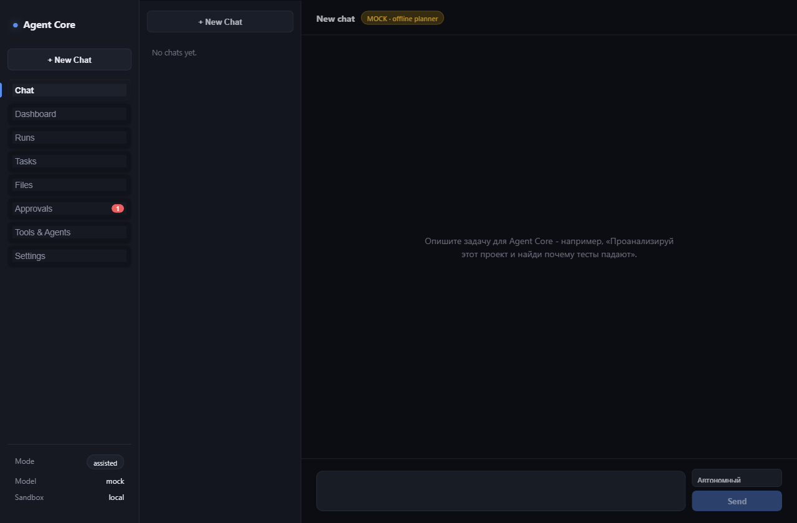
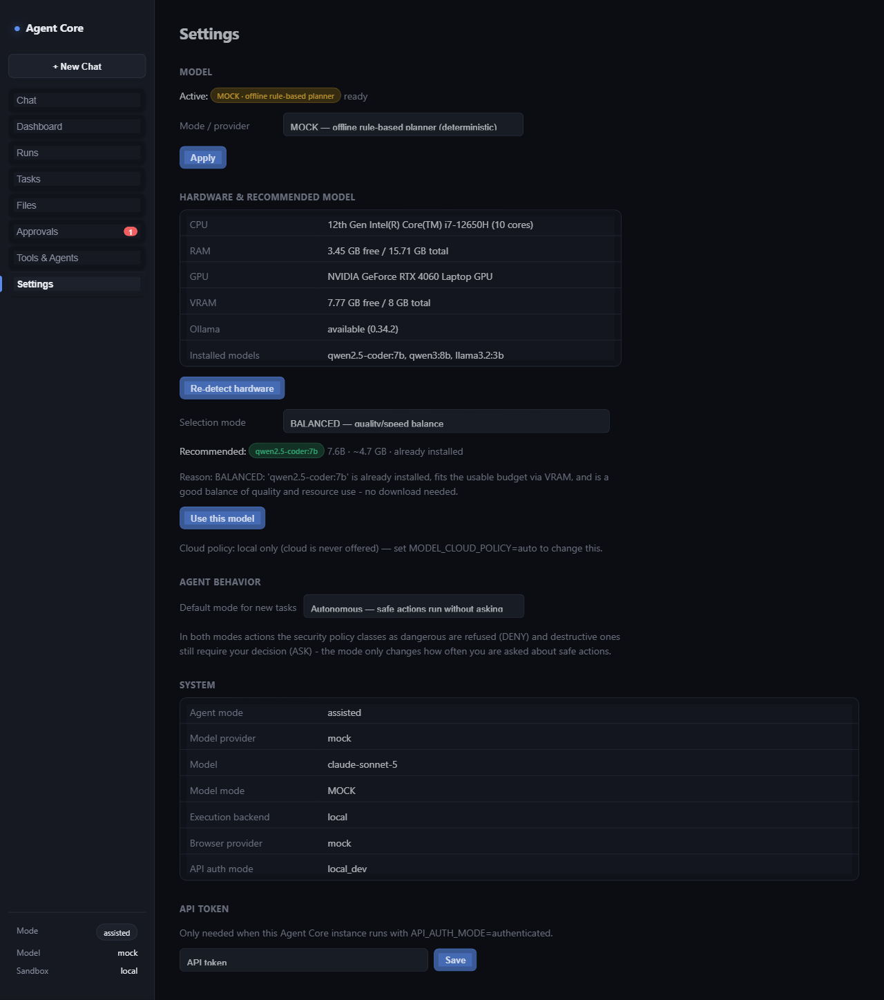
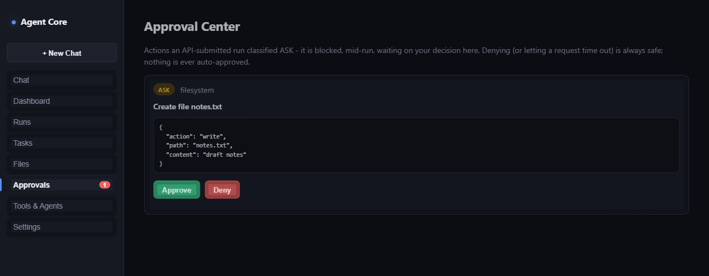

# Agent Core

**A local-first, evidence-based autonomous agent for real development and desktop work.**

Agent Core takes a task in plain language, plans it, executes it through a
sandboxed set of tools, and — unlike most agent demos — **verifies its own
work against independent evidence before calling it done.** It runs fully
offline by default (a deterministic rule-based planner, zero required
third-party dependencies, zero credentials) and upgrades to a real local
model (via [Ollama](https://ollama.com)) or a cloud model (Anthropic
Claude) when you choose to configure one — never silently.

> **This is a public showcase.** It documents what Agent Core does, how it
> behaves, and how it's built — conceptually. The proprietary
> implementation (the planner, the verification engine, the permission
> engine, model-routing logic, and Computer Use internals) is **not**
> included in this repository. See [Commercial &
> Partnership](#commercial--partnership) below.

---

## What is Agent Core?

A desktop AI agent capable of:

| Capability | Status |
|---|---|
| **Local LLM planning** (Ollama) | ✅ Implemented, real integration verified end-to-end with a local model |
| **Cloud LLM planning** (Anthropic Claude) | ⚠️ Implemented, not independently verified in the most recent internal pass (no API key was configured during that pass) |
| **Offline / deterministic planning** (no model at all) | ✅ The default mode — no API key, no local model, no network required |
| **Hardware-aware local model selection** | ✅ Detects CPU/RAM/GPU/VRAM and recommends a model that safely fits, with a documented safety margin |
| **Filesystem, terminal, and git tools** | ✅ Sandboxed to a configured workspace root |
| **Browser automation** | ✅ Real Playwright backend verified end-to-end (navigate, click, extract, screenshot, multi-tab, downloads) |
| **Computer Use** (real mouse/keyboard/screen control) | ⚠️ Off by default; the automation backend builds and is unit-tested, but live desktop-control execution has not been independently re-verified in the most recent internal pass |
| **Autonomous, goal-driven workflows** | ✅ Goal → plan → execute → verify → evidence, with resumable checkpoints |
| **Approval workflows (human-in-the-loop)** | ✅ Risk-classified actions can require explicit human approval before running |
| **Evidence-based verification** | ✅ A run is only reported complete when independent evidence (file exists, correct content, exit code, test/lint result) backs every claimed step |
| **Desktop packaging (Windows)** | ✅ A packaged installer exists and was verified through the packaged app's own API; interactive-click testing of that exact packaged build is still pending |
| **Web control center** | ✅ A React-based UI for chat, run history, approvals, and settings |

We do not claim a capability is "done" unless it has been independently
exercised and produced real evidence — see [Capabilities](docs/capabilities.md)
for the full, honestly-labeled breakdown (✅ verified / ⚠️ partial /
🧭 planned), and [Roadmap](docs/roadmap.md) for what's next.

## Why this is different

Most agent demos show a single happy path and stop. Agent Core is built
around one question: **how do you know it actually worked?**

- A completed step isn't "the model said it wrote a file" — it's "the file
  was read back from disk and its content checked."
- A failed verification is reported as failed, not quietly reclassified as
  success.
- An action the agent isn't confident is safe doesn't run silently — it
  either stops (denied) or waits for a human (approval), by policy, not by
  model judgment call.
- Status labels are honest: a milestone stays "partially verified" until
  every claimed capability actually has evidence behind it.

See [demo/](demo/) for six concrete scenarios — including one where a
verification step is deliberately made to fail, and the system reports
that failure correctly instead of hiding it.

## Architecture (high level)

```
                         ┌────────────────────┐
                         │   Goal / Task       │   plain-language input
                         └─────────┬──────────┘
                                   ▼
                         ┌────────────────────┐
                         │      Planner        │   local model / cloud model / offline rules
                         └─────────┬──────────┘
                                   ▼
                         ┌────────────────────┐
                         │  Permission Engine   │   ALLOW / ASK / DENY — one gate, every action
                         └─────────┬──────────┘
                    ┌──────────────┼──────────────┐
                    ▼              ▼              ▼
              Filesystem        Terminal        Browser / Computer Use
                    │              │              │
                    └──────────────┼──────────────┘
                                   ▼
                         ┌────────────────────┐
                         │      Verifier        │   independent evidence check
                         └─────────┬──────────┘
                                   ▼
                         ┌────────────────────┐
                         │  Evidence / Report    │   COMPLETED only if proven
                         └────────────────────┘
```

Full diagram and explanation: [docs/architecture.md](docs/architecture.md).

## Screenshots

Real captures of the actual UI, running locally with the default MOCK
provider (no API key, no local model required). See
[demo/screenshots/](demo/screenshots/) for the full set and how they were
produced.

| | |
|---|---|
|  |  |
| Chat view | Hardware-aware model selection |
|  |  |
| Evidence-based verification | Human approval (ASK) |

## Demo scenarios

Six concrete, evidence-backed scenarios — each with Goal / Steps / Expected
result / Evidence:

1. [Simple task](demo/workflows/demo-1-simple-task.md)
2. [File creation + verification](demo/workflows/demo-2-file-creation-verification.md)
3. [Browser workflow](demo/workflows/demo-3-browser-workflow.md)
4. [Approval workflow](demo/workflows/demo-4-approval-workflow.md)
5. [Computer Use](demo/workflows/demo-5-computer-use.md)
6. [Failure recovery](demo/workflows/demo-6-failure-recovery.md)

## Security model

Every tool call passes through one gate: `REQUEST → CLASSIFY → POLICY →
ALLOW / ASK / DENY → EXECUTE`. See [docs/security.md](docs/security.md) for
the full model — autonomy modes, human takeover, secrets handling, local
vs. cloud model boundaries, filesystem/process sandboxing.

## API examples

Illustrative, non-sensitive interface examples (submitting a goal, polling
status, resolving an approval) live in [examples/](examples/).

## Commercial / Partnership

Agent Core's product surface — behavior, architecture, security model, and
demos — is public. The underlying implementation is a private, commercial
codebase ("Agent Core Core" / private core) and is not distributed here.

For private demonstrations, licensing, commercial integration, or
acquisition discussions, contact the project owner.

## License

This showcase repository (documentation, diagrams, and example snippets)
is licensed under [CC BY 4.0](LICENSE). It does **not** grant any rights to
the proprietary Agent Core implementation, which is not included here.
