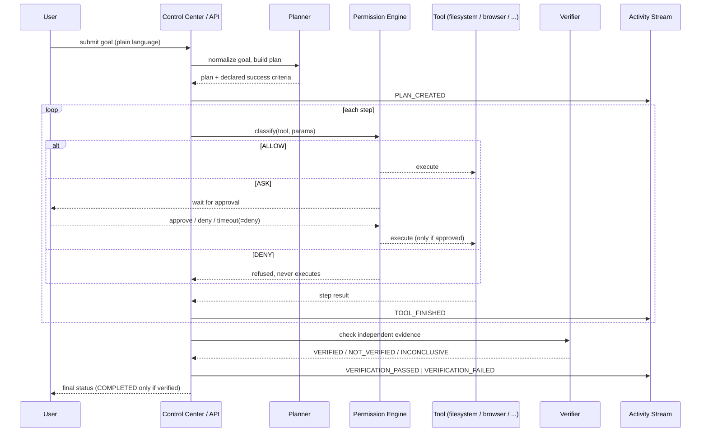
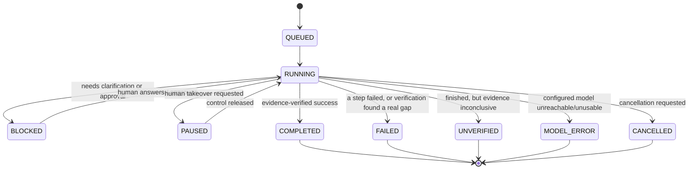
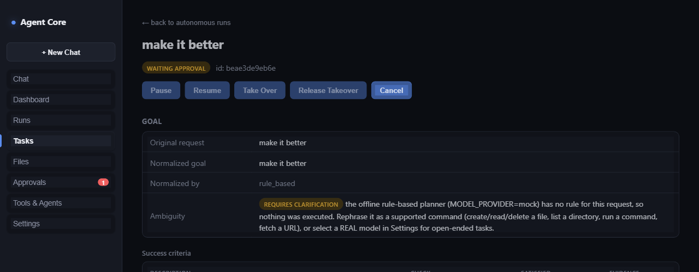

# Request lifecycle

How a single goal moves through the system, end to end.

## Run status lifecycle

`COMPLETED` is only reached through verified evidence — there is no path
from `RUNNING` straight to `COMPLETED` that skips the Verifier.

A `BLOCKED` run isn't a dead end — it carries the specific reason
clarification is needed, and answering it (via chat or
`POST /autonomous-runs/:id/answer`) resumes the same run rather than
starting a new one.
