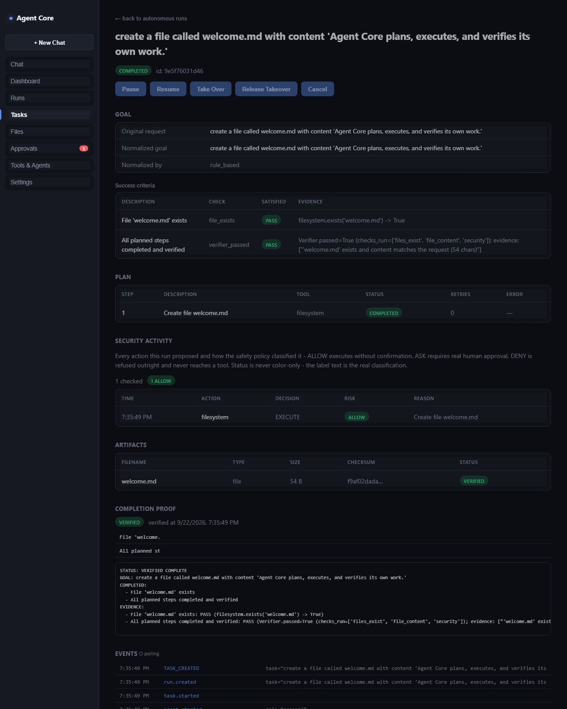

# Demo 1 — Simple task

The baseline case: a plain-language request that needs no external
research, no risky actions, and no human approval.

## Goal

> "Create a file called `hello.txt` with the content `Hello from Agent Core`."

## Steps

1. Submit the goal through the chat UI (or `POST /autonomous-runs`).
2. Agent Core normalizes the goal into an explicit plan with a declared
   success criterion ("`hello.txt` exists with the requested content").
3. The plan has one step: a filesystem write, classified `ALLOW` (creating
   a file in the workspace is not a destructive action), so it runs
   immediately without stopping for approval.
4. The Verifier reads `hello.txt` back from disk and checks its content
   against what was requested.
5. The run is reported complete.

## Expected result

- `hello.txt` exists in the workspace with the exact requested content.
- The run's status is `COMPLETED`.
- The activity stream shows: goal normalized → plan created → step
  executed → verification passed → run completed — each with a
  timestamp, in order.

## Evidence

- The success criterion in the run record reads something like:
  `File 'hello.txt' exists: PASS (filesystem.exists('hello.txt') -> True)`
- A second, independent verification criterion confirms the plan's steps
  all completed *and* passed verification — not just that the plan
  finished running.
- The file itself is readable on disk at the path reported.

This is the floor, not the ceiling: everything more advanced (research,
multi-step plans, approvals, browser/desktop control) builds on this same
plan → execute → verify → evidence loop.
