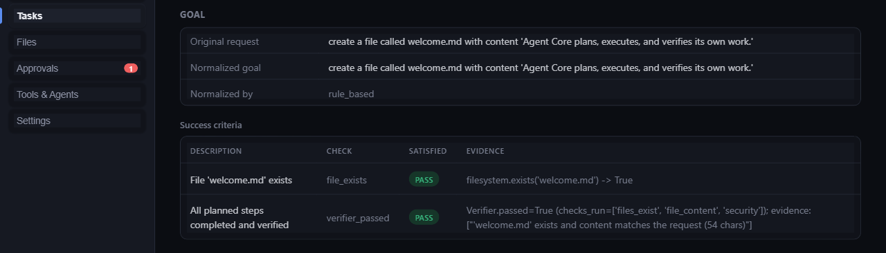

# Demo 2 — File creation + verification (and what happens when it's wrong)

This demo shows the verification layer actually *checking* something,
rather than trusting a claimed result — including the case where the
claim is wrong.

## Goal

> "Create a file called `report.md` in this repo with a short summary of
> what's in the `docs/` folder, and confirm the file was written
> correctly."

## Steps

1. Agent Core plans two things: gather a short list of what's in `docs/`,
   then write `report.md` with that summary.
2. The write step runs (`ALLOW` — creating a file inside the workspace).
3. The Verifier re-opens `report.md` from disk (not from the model's
   in-memory claim) and checks:
   - the file exists at the expected path,
   - its content is non-empty and matches what the step claimed to write,
   - the write didn't accidentally escape the sandboxed workspace root.
4. Only if every check passes does the run report `COMPLETED`.

## What happens if the file is wrong

The same pipeline is what catches a real, deliberately injected failure
mode: if something outside the tracked write step modifies or deletes
`report.md` afterward (a second process, a buggy tool, a race), the
Verifier's read-back at the end still reflects the *actual* file — so the
run correctly reports **not completed**, with the specific mismatch as
evidence, instead of a false "success."

This was directly tested during development: a tool made to silently
corrupt a just-written file's content, and a separate case where a
required file was deleted outside the tracked write path. In both cases
the system correctly reported the run as not-completed, with the exact
evidence gap named — never `COMPLETED`.

## Expected result

- Happy path: `report.md` exists with real content; run is `COMPLETED`
  with two independent pieces of evidence (existence + content match).
- Tampered path: the run is **not** `COMPLETED` (`FAILED`, or
  `UNVERIFIED` if execution finished but the claim couldn't be proven),
  and the report explicitly says what didn't match — never a silent
  false-positive.

## Evidence

- Happy path: the run's success criteria list a concrete, checkable
  claim (e.g. `filesystem.exists('report.md') -> True`) plus a
  content-match confirmation — not a generic "step succeeded."
- Tampered path: the real, observed evidence format for a missing file
  reads `expected path '<file>' to exist after write, but it does not`
  (confirmed with a different filename during internal adversarial
  testing) — a content-mismatch case reads along the lines of "content
  does not match" with the actual vs. expected noted. The point isn't the
  exact wording — it's that the report always names the specific gap,
  never just "failed."
