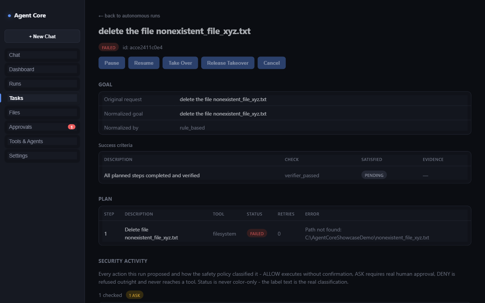

# Demo 6 — Failure recovery

Shows what happens when something genuinely goes wrong — a crash, a
model outage, or a tool that misbehaves — and why the system reports that
honestly instead of masking it.

## Goal

> "Refactor this module's error handling and make sure the test suite
> still passes."

## Scenario A — a tool fails mid-run

A step's underlying tool raises an unexpected error (a real bug in a
third-party integration, for example) partway through the run.

**Expected result:** the run ends in a `FAILED` state — never silently
retried into a false `COMPLETED`, and never left hanging indefinitely.
The failure reason is attached to the run's report in plain language, not
just an opaque error code.

**Evidence:** this exact scenario — a tool that raises instead of
returning a normal failure result — was deliberately tested during
development. It surfaced a real gap (the run correctly ended `FAILED`,
but its report initially carried no explanation), which was fixed and
covered by a regression test so the run's final report now always
explains *why* it failed, not just that it did.

## Scenario B — the configured model becomes unavailable

The configured real model (local or cloud) is unreachable, times out
repeatedly, or the model isn't actually pulled/available.

**Expected result:** the run ends in a distinct `MODEL_ERROR` state — it
does **not** silently continue on a different, less capable planning mode
while still claiming to use the configured model. This is opt-out, not
opt-in: the honest failure is the default behavior; falling back to a
different mode requires an explicit configuration choice, and even then
it's visible in the run's record.

**Evidence:** verified with a real, live connection failure (pointed at a
genuinely closed local port) — the run raises the typed error and no file
changes happen, confirming nothing ran under a false premise.

## Scenario C — a process crash mid-run (desktop app)

The backend process crashes while a run is in progress (in the packaged
desktop application).

**Expected result:** the desktop shell detects the crash and restarts the
backend automatically, within a bounded retry budget (it does not retry
forever) — and a run that was mid-flight at crash time comes back as an
honest "interrupted" state on reconnect, available to resume explicitly,
rather than either silently vanishing or silently resuming on its own
without the user's awareness.

**Evidence:** verified via a dedicated crash-test suite covering: backend
crash and bounded auto-restart, a hung (unresponsive but not crashed)
backend detected and restarted, a repeated-crash scenario hitting the
restart budget without looping forever, and a clean shutdown leaving no
orphaned processes behind.

## Why this matters more than the happy path

Any agent demo can show a task completing. The harder, more useful
property is what happens when it *doesn't* — and Agent Core's answer is:
report it, evidence and all, never paper over it.
