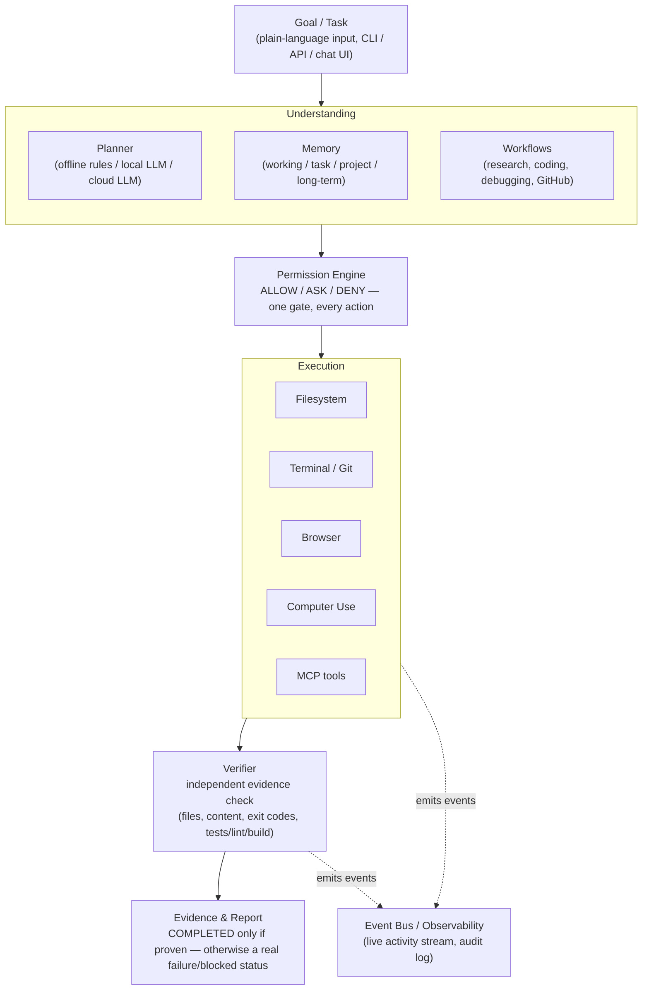
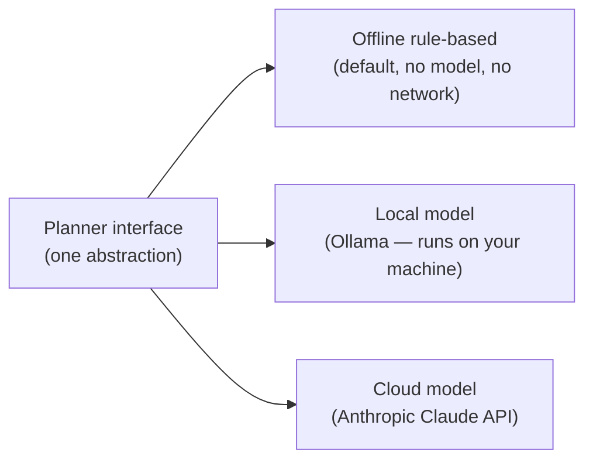

# Architecture

This describes Agent Core's architecture **conceptually** — the layers,
the data flow, and the guarantees each layer provides. It does not include
file-level implementation detail, internal module names, or the specific
logic inside the planner/verifier/permission engine — that's the private
core (see [README](../README.md#commercial--partnership)).

## Layers

## What each layer guarantees

**Understanding.** A goal is normalized into an explicit plan with
declared success criteria *before* anything runs. The planner is
provider-agnostic: the same downstream pipeline runs identically whether
planning comes from the offline rule-based planner (default, no model), a
local model via Ollama, or a cloud model via Anthropic's API. Memory
persists working context across steps and, separately, durable facts
across sessions — with a hard rule that anything shaped like a secret
(API key, token, password) is refused rather than stored (see
[Security](security.md)).

**Permission Engine.** Every single tool call — regardless of which layer
requested it, regardless of autonomy mode — passes through one policy
gate that classifies it `ALLOW` (runs automatically), `ASK` (a human must
approve first), or `DENY` (never runs, no override). This is the one
choke point every execution path shares; there is no code path that skips
it.

**Execution.** Tools are sandboxed to a configured workspace root
(filesystem/terminal/git) or run through an explicit adapter with its own
risk classification (browser, Computer Use, MCP servers). Browser
automation and Computer Use (full desktop control) are kept as distinct
capabilities — a browser tab is a materially smaller blast radius than
the whole desktop, and Computer Use is off by default.

**Verifier.** After execution, Agent Core re-checks what actually happened
against independent evidence — it does not trust the model's own claim
that a step succeeded. A written file is read back and its content
checked; a deleted path is confirmed gone; a terminal step's real exit
code is inspected; an optional test/lint/build command's real result
counts. Only evidence-backed completion is reported as `COMPLETED`.

**Evidence & reporting.** Every run's final status is one of a small,
honest set: completed (verified), failed, blocked (needs human input),
cancelled, or a model error (the configured model was unavailable — never
silently downgraded to a different mode). See
[Capabilities](capabilities.md) for exactly which of these are backed by
independent, reproducible verification today.

**Observability.** Every tool call, permission decision, model request,
and verification result is published as a structured event — the basis
for the live activity stream in the control center UI and for after-the-
fact audit.

## Local-first, provider-agnostic model layer

The planner never assumes which of these is behind it. Switching providers
is a configuration change, not a code change, and a provider that becomes
unreachable produces an explicit, honest error state rather than silently
falling back to a different mode without telling you.

## Hardware-aware local model selection

When using a local model, Agent Core can detect the host machine's real
CPU, RAM, GPU, and VRAM, and recommend a model sized to fit — with a
documented safety margin so a recommendation is never made right at the
edge of available memory. This runs entirely locally; nothing about the
machine's hardware is sent anywhere. See [Security](security.md) and
[Capabilities](capabilities.md).

## Desktop packaging

A packaged Windows build wraps the same backend + web control center as a
single desktop app (no separate Python install required for the end
user), with bounded automatic recovery if the backend process crashes.
See [Roadmap](roadmap.md) for other platforms.
